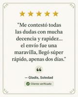
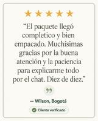
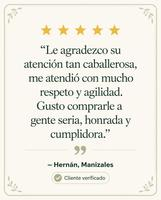
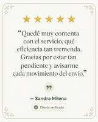
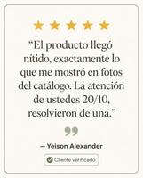

# TESTIMONIOS DE ATENCIÓN — Jabón Facial Aclarante y Despigmentante Serum 10 (Ácido Kójico + Niacinamida, 100g) — 2026-09-27

## Contexto
- **Producto:** Jabón facial Serum 10 con ácido kójico y niacinamida, 100g
- **Origen de los testimonios:** capturas reales de WhatsApp de clientes de la tienda (calificación 5/5 + mensaje espontáneo), recolectadas por el negocio. No son de este producto específico — son sobre la atención/despacho general de la tienda, reutilizables como prueba social de servicio mientras se acumulan reseñas propias del jabón.
- **Anonimización:** primer nombre + ciudad (o solo primer nombre cuando no se mencionó ciudad). Sin fotos de perfil personales, sin apellido completo, sin número de teléfono.

## ⚠️ Nota de compliance para la campaña completa de este producto
"Aclarante" y "despigmentante" son claims de alto riesgo en Meta y TikTok: se tratan como atributos/cambios de apariencia y activan revisión o rechazo automático, y en varios mercados estas plataformas restringen directamente productos de "blanqueamiento/aclarado de piel". Antes de escribir guiones o copys para este producto (no solo estas tarjetas de testimonio), hay que:
- Evitar prometer "aclara la piel" como resultado garantizado; usar lenguaje de rutina de cuidado ("ayuda a unificar el tono", "rutina de skincare con ácido kójico y niacinamida") en primera persona, no como promesa de la marca.
- No usar antes/después de tono de piel.
- Revisar la landing y el nombre público del producto en los anuncios — puede necesitar un nombre comercial distinto al interno para evitar el rechazo automático por palabras clave.
- Confirmar con la skill `tiktok-ad-compliance` / `investigaciones/06-compliance-policies.md` del Agente de Copy antes de lanzar cualquier pieza de venta.

Esta nota no bloquea las tarjetas de testimonio de abajo (son sobre atención/despacho, no sobre resultados en la piel), pero sí aplica a cualquier guion o copy de producto que hagamos después.

---

## Tarjetas de testimonio (prueba social de atención)

**Gladis, Soledad** — [editar en Canva](https://www.canva.com/M/MAHWbEZO5oc)

**Wilson, Bogotá** — [editar en Canva](https://www.canva.com/M/MAHWbCydiOg)

**Hernán, Manizales** — [editar en Canva](https://www.canva.com/M/MAHWbERS5_U)

**Sandra Milena** — [editar en Canva](https://www.canva.com/M/MAHWbIdSq2U)

**Yeison Alexander** — [editar en Canva](https://www.canva.com/M/MAHWbEbNdyI)

**Uso sugerido:** grid de social proof en la ficha de producto o como imagen de refuerzo (nivel "Product aware") en la campaña de este jabón, igual que en las campañas de labbazar. Como son testimonios de atención/despacho y no del jabón en sí, lo ideal es etiquetarlos en la tienda como "Así califican nuestro servicio" en vez de atribuirlos directamente al producto.

## Pendiente
- [ ] Reseñas reales específicas de este jabón (cuando existan) para reemplazar o complementar estas.
- [ ] Definir con el usuario si se arma la campaña completa (4 videos + 2 imágenes) para este producto, con el filtro de compliance de aclarante/despigmentante aplicado.
